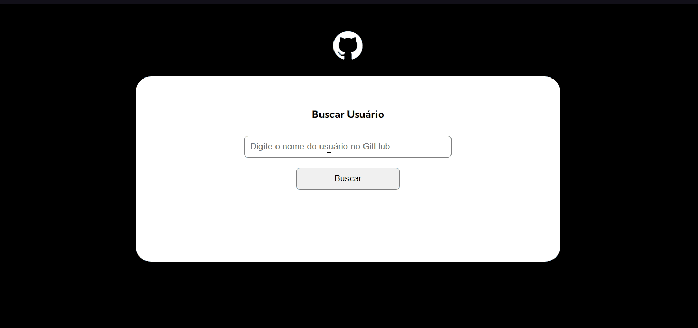
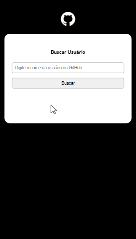

# Projeto-Fetch-GitHub-Api
<h1 align="center">
   
</h1>

Acesse o perfil de qualquer usuário cadastrado na plataforma do GitHub, escolha um repositório e clique para ser direcionado para a página do projeto.

<i>"Seja bem-vindo"</i>

 

  <kbd>
    
  </kbd>
  &nbsp;&nbsp;&nbsp;&nbsp;
  <kbd> 
    
  </kbd>
  &nbsp;&nbsp;&nbsp;&nbsp;

  

## Tecnologias utilizadas
- HTML
- CSS
- JavaScript
  

Made with 💙 by Gustavo Mattos 👋 [See my LinkedIn](linkedin.com/in/guh-mattos/)

